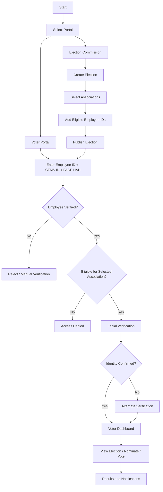

## High Level Architecture

```mermaid
flowchart TD
    A["Start"] --> B["Select Portal"]

    B --> C["Election Commission"]
    B --> D["Voter Portal"]

    C --> E["Create Election"]
    E --> F["Select Associations"]
    F --> G["Add Eligible Employee IDs"]
    G --> H["Publish Election"]

    D --> I["Enter Employee ID + CFMS ID + FACE HAH"]
    H --> I

    I --> J{"Employee Verified?"}

    J -->|No| K["Reject / Manual Verification"]
    J -->|Yes| L{"Eligible for Selected Association?"}

    L -->|No| M["Access Denied"]
    L -->|Yes| N["Facial Verification"]

    N --> O{"Identity Confirmed?"}

    O -->|No| P["Alternate Verification"]
    O -->|Yes| Q["Voter Dashboard"]

    P --> Q

    Q --> R["View Election / Nominate / Vote"]
    R --> S["Results and Notifications"]
```
